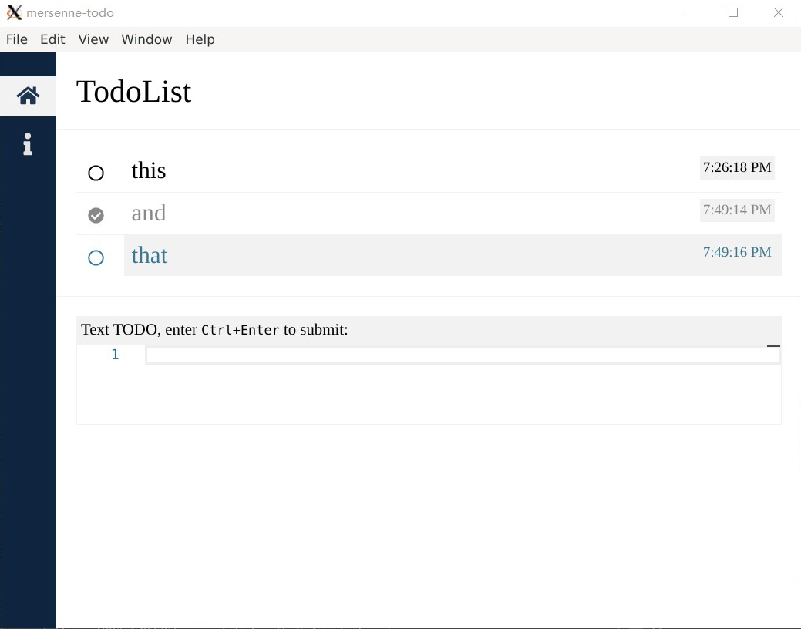

# mersenne-todo

> A nice planner. Builded on `electron` and `vue`.

## Screenshot

<p align="center"></div>

## run by bin file

Go to [here](https://github.com/PeterlitsZo/MersenneTodo/releases/tag/v0.0.2-alpha)
for download.

## build/run by source

Before build/run it, you should download `yarn` and download this project's
dependency:

``` shell
sudo apt install yarn
yarn
```

### Builded for Windows and Linux

Run script in shell:

``` shell
yarn electron:allbuild
```

### Run in electron application

Run script in shell:

``` shell
yarn electron:serve
```

## Todo

This is a todo list for this project:

- [ ] Root
  - [ ] Comman
    - [ ] Feat: title component
  - [ ] Nav
    - [ ] Feat: Use flex display
    - [x] Fix : nav(build-in name) -> Nav
    - [x] Feat: Unloading: background: none;
    - [x] Feat: Add info link
  - [ ] TodoList
    - [ ] Feat: make the overflow bar like the Monaco editor bar
    - [ ] Feat: history
    - [ ] Feat: Tool kits for Bars
      - [ ] Feat: defined as a component
    - [ ] Feat: Make it suppose the MarkDown highlight
    - [ ] Feat: Make it can deal with MarkDown
    - [ ] Feat: Todo as a tree
    - [x] Feat: Make the editor at the end
    - [x] Feat: make the Bar's OK area be bigger
    - [x] Fix : fix that it cannot build (bacause webpack, i guess).
    - [x] Feat: Use `yarn` but not `npm`
    - [x] Feat: Can make the todolist be stored as a `.json` file.
    - [x] ...
  - [ ] DayChart
  - [ ] Code Editor
  - [ ] Info
    - [ ] Feat: make Info looks great
      - [ ] ...
      - [x] Add a title
    - [x] Feat: Info about github address, issue address
  - [ ] Others
    - [ ] Feat: Use Vuex
    - [ ] Feat: remove the bars of the application
    - [ ] Feat: add a icon of the application
    - [x] Fix : move the default json file be other place.

### Customize configuration

See [Configuration Reference](https://cli.vuejs.org/config/).
