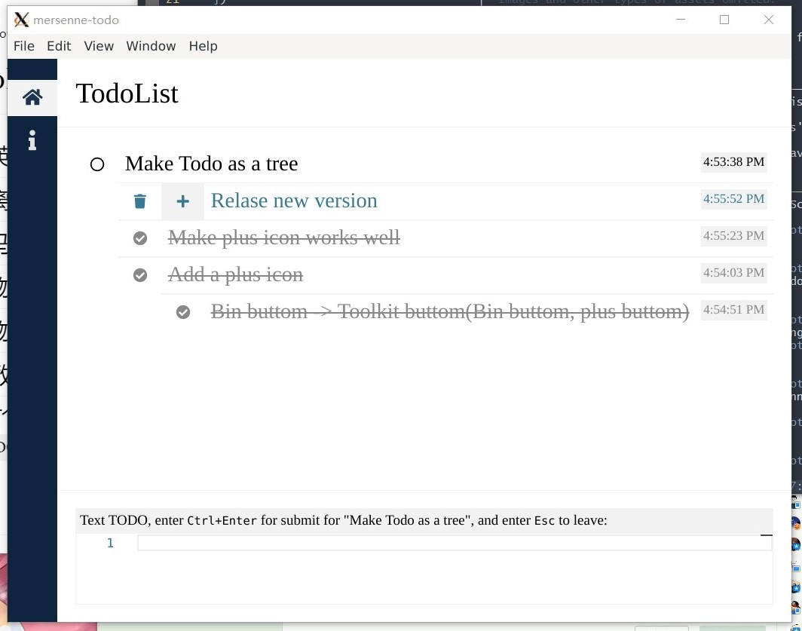

# mersenne-todo

> A nice planner. Builded on `electron` and `vue`.

## Screenshot

<p align="center"></div>

## Download

Go to [release page](https://github.com/PeterlitsZo/MersenneTodo/releases)
to download the lastest MersenneTodo.

## build/run by source

Before build/run it, you should download `yarn` and download this project's
dependency:

``` shell
sudo apt install yarn
yarn
```

### Builded for Windows and Linux

Run script in shell:

``` shell
yarn electron:allbuild
```

### Run in electron application

Run script in shell:

``` shell
yarn electron:serve
```

## Todo

This is a todo list for this project:

- [ ] Root
  - [ ] Comman
    - [ ] ...
    - [x] Feat: icon component
    - [x] Feat: title component
  - [x] Nav
  - [ ] TodoList
    - [ ] Feat: Javascript support
    - [ ] Feat: make the toolkit auto pop
    - [ ] Feat: update the default helpful msg
    - [ ] Feat: make the overflow bar like the Monaco editor bar
    - [ ] Feat: history
    - [x] Feat: fold the tree todo
    - [x] Feat: bar state: OK / not OK / list
    - [x] Feat: Make it support the MarkDown highlight
    - [x] Feat: Make it can deal with MarkDown
    - [x] Feat: Todo as a tree
    - [x] ...
  - [ ] DayChart
  - [ ] Code Editor
  - [ ] Others
    - [ ] Fix : the setTimeout function in src/main.js
    - [ ] Feat: remove the title bars of the application
    - [ ] Feat: add a icon of the application
    - [x] Feat: Use Vuex
    - [x] Fix : flex looks bad.
    - [x] Fix : move the default json file be other place.
  - [ ] Setting
    - [ ] Setting the path. (add a setting json file)
    - [x] Open file manager of the userdata json file
  - [x] Info

